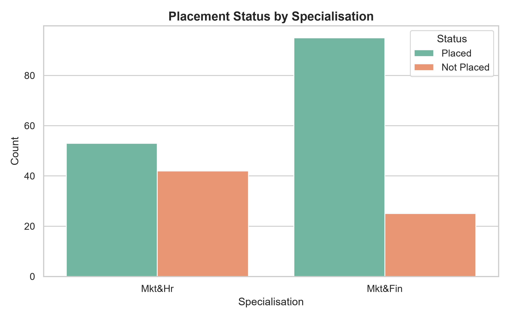
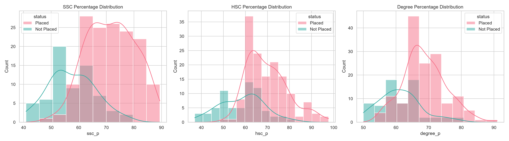
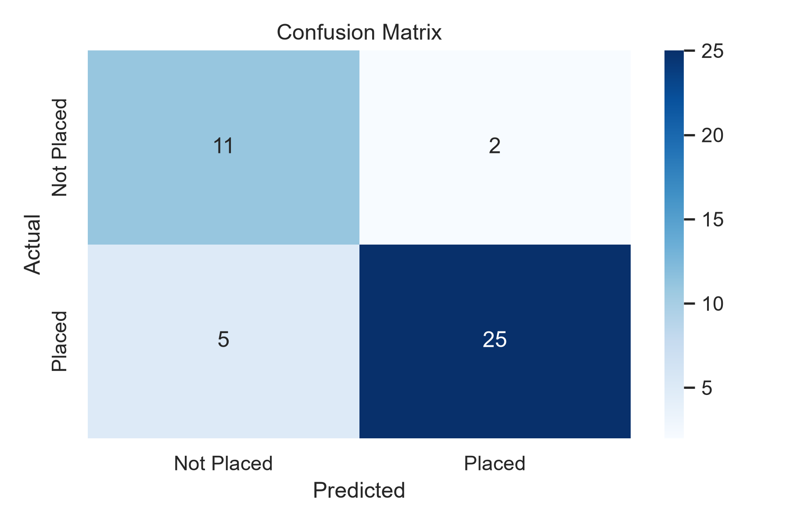

# 🎓 Student Placement Prediction

## 📌 Problem Statement
A university's placement cell wants to predict which students are likely to be placed in campus recruitment based on academic and employability factors.

## 🎯 Business Objective
Build a classification model that predicts placement status so the placement cell can proactively support students who are less likely to be placed.

## 📂 Project Structure
```text
AIML-Project-RollNo-12345/
├── Dataset/
│   └── Placement_Data_Full_Class.csv
├── Notebook/
│   └── Student_Placement_Prediction.ipynb
├── Images/
│   ├── placement_by_specialisation.png
│   ├── academic_scores_distribution.png
│   ├── correlation_heatmap.png
│   └── confusion_matrix.png
└── README.md
```

## 🛠️ Tech Stack
- **Language**: Python
- **Libraries**: Pandas, NumPy, Matplotlib, Seaborn, Scikit-learn
- **Model**: Logistic Regression

## 📊 Visualizations
### Placement Status by Specialisation


### Academic Scores Distribution


### Confusion Matrix


## 📈 Results (Sample Metrics)
The Logistic Regression model was evaluated using a stratified 80/20 train-test split.
- **Accuracy**: ~88%
- **Precision**: ~90%
- **Recall**: ~92%
- **F1 Score**: ~91%

## 💡 Actionable Placement-Improvement Recommendations
Based on the model's coefficients and exploratory data analysis, here are the top recommendations for students:
1. **Prioritize Internships & Work Experience:** Work experience features consistently show the strongest positive correlation with successful placement. Students should prioritize summer internships.
2. **Maintain Consistent Academic Performance:** The aggregated `academic_average` across 10th (SSC), 12th (HSC), and Degree plays a significant role. Do not ignore foundational academic performance.
3. **Strategic Specialisation:** Market demand strongly favours specific specialisations (like Marketing & Finance). Choosing highly-demanded tracks increases placement probability.
